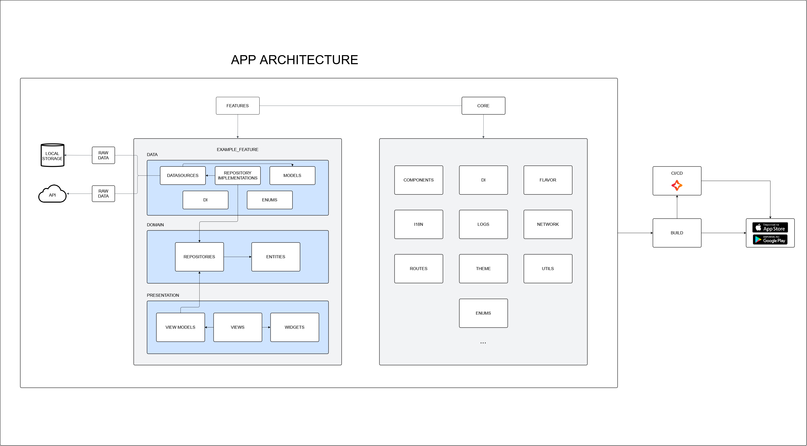

# Loomi Flutter MVVM Leap

### Userful links

- [Flutter Loomi GitBook](https://loomi.gitbook.io/flutter-loomi/)

## 1. Environment Setup

#### Depends on Flutter 3.35.3 and Dart 3.9.2 >

### Prerequisites
- Flutter
- Dart
- Android Studio / Xcode
- Emulator or physical device for testing

### Development Environment Setup
- Set up an Android or iOS emulator
- Check the PATH settings for Flutter and Dart
- Ensure that the environment variables are configured correctly
- Install FVM to manage flutter versions across multiple projects

### Installation Instructions
1. Clone the repository:
```bash
git clone https://github.com/loomi/flutter-mvvm-leap.git
```

2. Navigate to the project directory:
```bash
cd flutter-mvvm-leap
```

3. Install the dependencies:
```bash
flutter pub get
```

### Icons generation
- `Go to pubspec file and add the path of your icon on 'flutter_launcher_icons' section`
- `The icon should be 512x512 or 1024x1024`
- `dart run flutter_launcher_icons ou flutter pub run flutter_launcher_icons`

### To start a new project:
- `replace the 'com.example.flutterMvvmLeap' across all the files with your desired bundleId`
- `on android/app/src/main/kotlin rename the subsequent folder names with your bundle id name`
- `on .vscode/ create launch.json with configurations to run different flavors more easily`

### Generating Keystore File for Release
1. Generate a keystore file:
```bash
keytool -genkey -v -keystore ~/upload-keystore.jks -keyalg RSA -keysize 2048 -validity 10000 -alias upload
```

2. Create the `android/key.properties` file with the following settings:
```
storePassword=<keystore_password>
keyPassword=<key_password>
keyAlias=upload
storeFile=<path_to_keystore>/upload-keystore.jks
```

### Using I18n validator
- `run 'dart run tools/i18n_validator/main.dart' to validate strings used on dart files`

## 2. Project Architecture

### Directory Structure
The project follows an organized structure in main folders:
- `lib/core`: Settings and utilities
- `lib/features`: App features
- `test`: Unit tests
- `tools`: Developer tools

### Architecture Patterns Used
The project uses the MVVM (Model-View-ViewModel) architecture.



### Data Flow
1. **Data Layer**:
   - **Datasources**: Responsible for communication with external sources, such as APIs and databases.
   - **Repositories**: Implementation layer that bridges data sources and the domain layer. They implement interfaces defined in the domain layer and are responsible for manipulating data received from datasources, applying transformations or caching if necessary.
   - **Models**: Representation of application data, mapped from API responses or databases.

2. **Domain Layer**:
   - **Entities**: Business objects that represent fundamental concepts of the application. They are more stable and independent of infrastructure changes.
   - **Repositories**: Definition of interfaces that describe the data access operations that can be performed. They do not contain implementation logic but rather contracts that implementations in the data layer must follow.

3. **Presentation Layer**:
   - **ViewModels**: Manages the user interface state. Processes events from the View, accesses repositories to fetch or send data, and emits new states to the View.
   - **Views**: Composed of screens and visual components that consume the ViewModel state. They send events to the ViewModel in response to user interactions, such as clicks or data entries.

### Key Components
- **Mappers**: Convert Models (from datasources) to Entities (domain objects). Located in `data/mappers/`, they ensure separation between API structures and business logic.
- **Result/Failures**: Error handling pattern using `Result<FailureType, Success>`. Allows handling success and failure cases explicitly without exceptions.
- **Routes**: Navigation system using GoRouter. Routes are defined in `core/routes/app_routes.dart` with type-safe paths.
- **Dependency Injection (DI)**: Uses GetIt for service registration and dependency management. All dependencies are configured in `core/di/app_dependencies.dart`.
- **Flavors**: Environment configuration (dev, hml, prod) with different base URLs and settings per environment.
- **I18n**: Internationalization system supporting multiple languages (en_US, es_ES, pt_BR). JSON-based translations with parameter and plural support.
- **Theme**: Dynamic theme switching (light/dark) with animated transitions. Theme preference is persisted locally.
- **Network**: HTTP client abstraction using Dio with interceptors and custom configuration per flavor.
- **Logger**: Centralized logging system with multiple output targets (terminal, crash reporting, etc).
- **Services**: Device utilities (info, local preferences, secure storage, settings, share) and event bus for decoupled communication.

### State Management
The project uses Bloc/Cubit to implement the MVVM ViewModel pattern, but it can be adapted for the desired management.
- **Cubit**: For simple states (used as a simplified ViewModel)
- **Bloc**: For more complex states with events (used as a more robust ViewModel)
- **Repository Pattern**: For data source abstraction

## 3. License
Made with ❤️ by **Loomi**
